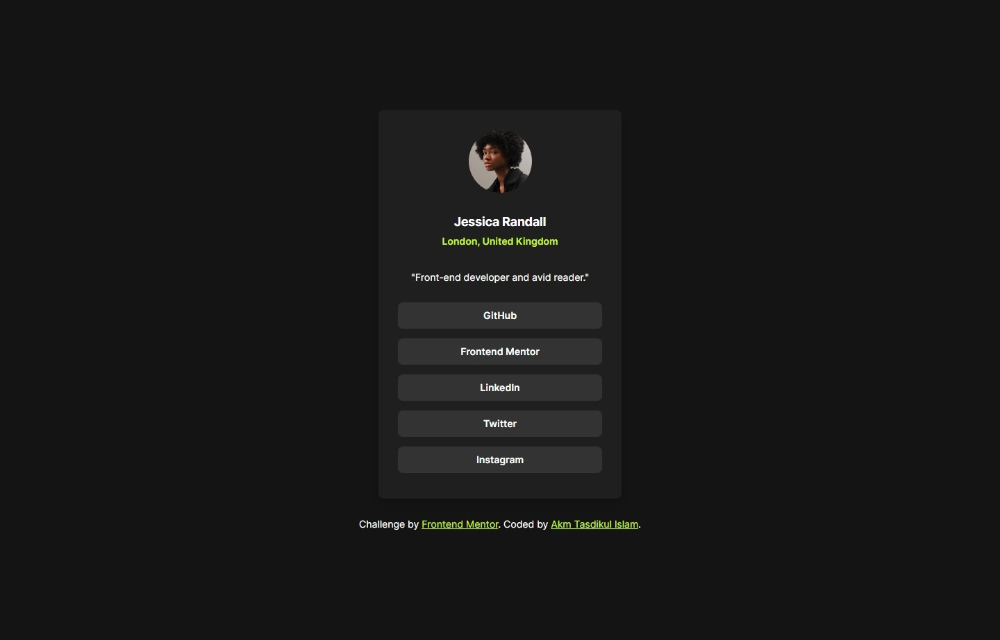
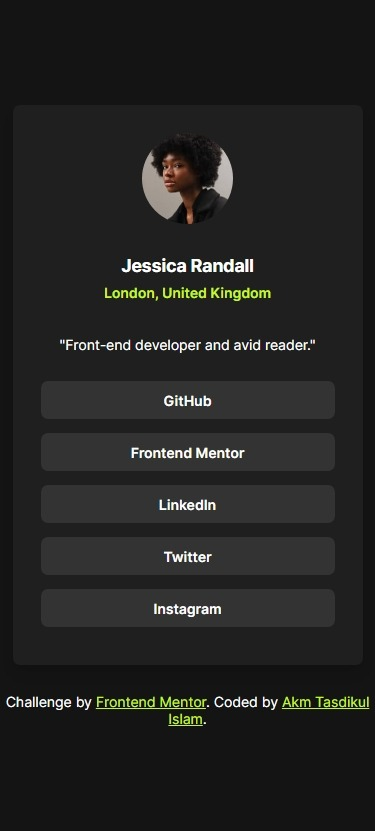

# Frontend Mentor - Social links profile solution

This is a solution to the [Social links profile challenge on Frontend Mentor](https://www.frontendmentor.io/challenges/social-links-profile-UG32l9m6dQ). Frontend Mentor challenges help you improve your coding skills by building realistic projects.

## Table of contents

- [Overview](#overview)
  - [The challenge](#the-challenge)
  - [Screenshot](#screenshot)
  - [Links](#links)
- [My process](#my-process)
  - [Built with](#built-with)
  - [What I learned](#what-i-learned)
  - [Useful resources](#useful-resources)
- [Author](#author)

## Overview

Project Start Date: 16 February 2024
Project Duration: 50 minutes

### The challenge

Users should be able to:

- See hover and focus states for all interactive elements on the page

### Screenshot

| Desktop Version                         | Mobile Version                         |
| --------------------------------------- | -------------------------------------- |
|  |  |

### Links

- [Solution URL](https://github.com/akmtasdikulislam/social-links-profile)
- [Live Site URL](https://akmtasdikulislam.github.io/social-links-profile/)

## My process

- At first, I linked the `style.css` & _Google Fonts CDN_ with `index.html`
- Then, imported _CSS Color Variables_ and _base font size_ which were provided in the `style-guide.md` file.
- After this, I initailized the `css` file and set the minimum height and width, background color, font-family and font-color for the `body` element.
- Then, I wrote the necessary `html` code to develop the _UI Design Sample_ and also added necessary css stylings to match as close as possible withe the _UI Design Sample_.
- Finally, added necessary stylings for the active-states.

### Built with

- Semantic HTML5 markup
- CSS custom properties
- Flexbox

### What I learned

This was a simple basic project with HTML and CSS. As I've done similar projects earlier, by doing this project, I just revised my previous learnings.

### Useful resources

- [100 CSS Box Shadow Examples](https://htmlcssfreebies.com/css-box-shadow-examples/) - This helped me to add box shadow.

## Author

- Frontend Mentor - [@akmtasdikulislam](https://www.frontendmentor.io/profile/akmtasdikulislam)
- Twitter - [@Akm_Tasdikul](https://www.twitter.com/Akm_Tasdikul)
